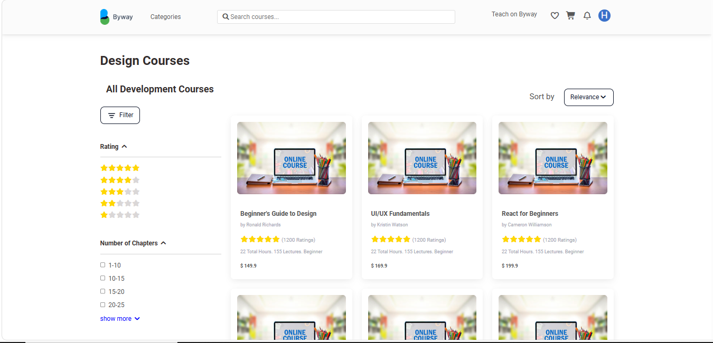
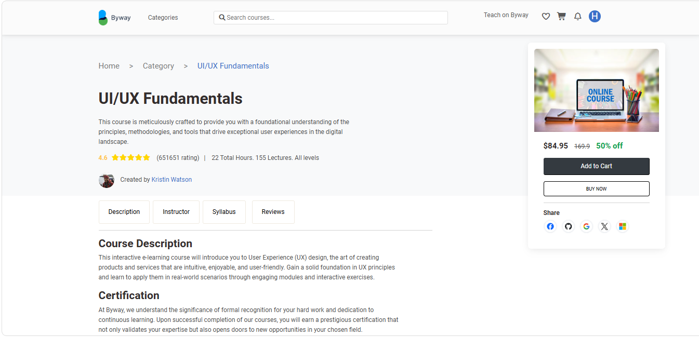

<div align="center">


# 📚 ByWay — E-Learning Platform

**A modern e-learning platform built with React to deliver online courses through an interactive and user-friendly experience.**  
It enables students to browse courses, watch lessons, and track their progress seamlessly through a clean, simple interface.

<br/>


</div>

---

## 🌟 About The Project

**ByWay** is a practical training project designed to simulate a real-world e-learning platform. The goal was to build a fully functional, responsive course platform that mirrors the experience of popular online learning websites — but built from scratch as a hands-on learning exercise.

> 💡 *This project was created as a practical training exercise to strengthen React & Bootstrap skills — it is a **Frontend-only** project with no backend integration.*

---

## ✨ Features

- 🏠 **Home Page** — Landing page with featured courses and categories
- 📖 **Course Browsing** — Explore and filter available courses
- 🎬 **Lesson Viewer** — Watch course lessons in a clean layout
- 📊 **Progress Tracking** — Track learning progress per course
- 📱 **Fully Responsive** — Works seamlessly on all screen sizes
- 🎨 **Clean UI** — Simple and modern design using Bootstrap

---

## 🛠️ Built With

| Technology | Purpose |
|---|---|
| **React.js** | Frontend UI & component architecture |
| **React Router** | Client-side navigation |
| **Bootstrap 5** | Responsive layout & styling |
| **React Bootstrap** | Pre-built Bootstrap components for React |
| **JavaScript (ES6+)** | Application logic |

---

## 🚀 Getting Started

### Prerequisites

Make sure you have the following installed:

- [Node.js](https://nodejs.org/) (v16 or higher)
- npm or yarn

### Installation

```bash
# 1. Clone the repository
https://github.com/hassan4366/Courses-platform.git

# 2. Navigate into the project folder
cd Courses-platform

# 3. Install dependencies
npm install

# 4. Start the development server
npm start
```

The app will run at `http://localhost:3000` 

---

## 📁 Project Structure

```
byway/
├── public/
│   └──CSS/
│   └── JS/
│   └── Img/
│   └── Webfonts/              # Images, icons, fonts
│   └── index.html

├── assets/
│   └──Image/

├── Src/
│   └──components/      # Reusable UI components
│   └──Cart/
│   └──Category/
│   └──Checkout/
│   └──Data/
│   └──Home/            # Page-level components
│   └──App.js
│   └──index.js

├── package-Lock.json
├── package.json
└── README.md
```

---

## 📸 Screenshots

| Courses Page | Deatils-Course Page |
|-----------|-------------|
|  |  |


---

## 🎯 What I Learned

Working on **ByWay** helped me practice and reinforce:

- ✅ Component-based architecture in React
- ✅ React Router for multi-page navigation
- ✅ State management with `useState` and `useEffect.`
- ✅ Responsive design with Bootstrap grid system
- ✅ Structuring a real-world project from scratch
- ✅ Clean code organization and folder structure

---

## 🔮 Future Improvements

- [ ] Add course search and filter functionality
- [ ] Implement a real progress tracker with local storage
- [ ] Add dark mode support
- [ ] Improve animations and page transitions
- [ ] Add more pages (Instructor profile, Course details)

---

## 🤝 Contributing

This is a personal training project, but feedback and suggestions are always welcome!  
Feel free to open an issue or submit a pull request.

---

## 📄 License

This project is open source and available for contribution.

---

---

##  Live Demo

<a href="https://bywaycourses.netlify.app/">Click Here</a>

---


## Made by :
<a href="https://github.com/hassan4366">Hassan Hammam</a>

<a href="#">Hassan Tantawy</a>

<hr/>

**If you found this project helpful, consider giving it a star!** ⭐

</div>
